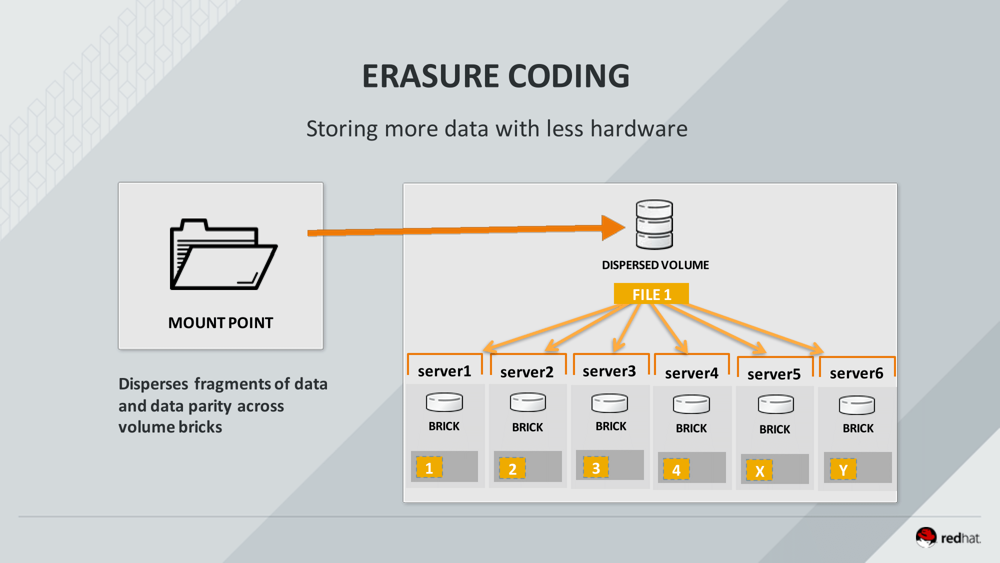

# Lab Guide <br/> Gluster Test Drive Module 4 <br/> Disperse Volumes (Erasure Coding)

## Lab Agenda

Welcome to the Gluster Test Drive Module 4 - Disperse Volumes (Erasure Coding). In this lab you will:

- Understand the basic concepts of erasure coding
- Create a gdeploy configuration for a disperse volume
- Deploy a disperse volume using gdeploy
- Write files to a disperse volume and observe the backend
- Manually fail bricks and observe the high availability of erasure coding


## Getting Started

If you have not already done so, click the  button in the navigation bar above to launch your lab. If you are prompted for a token, use the one distributed to you (or credits you've purchased).

> **NOTE** It may take **up to 10 minutes** for your lab systems to start up before you can access them.

## Lab Setup
### Connect to the Lab
Connect to the **rhgs1** server instance using its public IP address from the **Addl. Info** tab to the right (Linux/Mac example below).

```bash
ssh gluster@<rhgs1PublicIP>
```

## About Disperse Volumes

Gluster disperse volumes utilize **erasure coding** technology to provide data protection with a lower overall infrastructure investment. Unlike standard replication, in which to protect *n* bricks against *r* failures you must invest in a total of *n+(n\*r)* bricks, with erasure coding you can design for the same level of protection with an investment of only *n+(n/r)* or even less.

For example, assume you need *n=4* bricks to hold your data set and you require protection from failure of *r=2* bricks. If you use standard **replication**, your investment in bricks will be *4+(4\*2)* or **12 total bricks**. If instead you utilize **erasure coding**, your investment in bricks can be *4+(4/2)* or **6 total bricks**.



### Erasure Coding and Parity

Instead of writing multiple exact copies of data, erasure coding algorithms write a combination of *data* and *parity* across bricks in the volume. A number of encoding algorithms are available offering varying levels of protection in terms of a *redundancy-to-data* ratio. For our lab, you will be using a 4:2 ratio -- 2 levels of redundancy for every 4 data bricks, meaning that each disperse set requires exactly 6 bricks.

> **NOTE** This functionality is very similar to how RAID works at the block level. You can relate our 4:2 erasure coding ratio to RAID level 6.

When a file is written to the disperse volume, it is broken into calculated chunks of data and written across all of the bricks in the disperse set. When a file is read, it can be **algorithmically reassembled from any n of the bricks where n is the number of data bricks in the set**. Here with our 4:2 ratio, therefore, any 4 of the 6 bricks can be used to retrieve the files.

### Use Cases

Disperse volumes offer *space-efficient* and *capacity-optimized* storage architectures. However, there are a couple of primary tradeoffs when considering this method of data protection.

- The overhead of the algorithms can lead to decreased performance for your data set, particularly for reads and for small files.
- The files are no longer stored in their whole original form on the brick backends, making offline or backend retrieval of data impossible.

> **NOTE** Interestingly, it has been shown that, under most conditions with the Gluster native client, write performance is unaffected by erasure coding and is even sometimes modestly improved.

Disperse volumes should be used when capacity is of greater value than performance. Larger file workloads (1GB+) will experience the least performance degredation versus replicated volumes. *You should avoid using the NFS client with disperse volumes.*


## Build your gdeploy Configuration

You will use the **Ansible**-based deployment tool `gdeploy` in order to create your disperse volume. For this, you will need to build a custom configuration file. Store this file as `/home/gluster/ecvol.conf`.

> **NOTE** For your convenience, the `vim` and `emacs` editing tools are installed on all lab systems.

### Hosts Section

First you need to define in the config file the set of Gluster hosts that will participate in the disperse volume. You will use all 6 of your local lab server nodes.

```ini
[hosts]
rhgs1
rhgs2
rhgs3
rhgs4
rhgs5
rhgs6
```

### Backend-Setup Section

The backend setup across all of the Gluster nodes is identical, and therefore we need only one universal backend-setup section in the config file. In this section, you define the block devices that will host the bricks filesystems (**the block device should be xvdd**), the LVM structure (thin provisioning in this case), the filesystem mount point, and the subdirectory that will be used to host the brick.

```ini
[backend-setup]
devices=xvdd
vgs=rhgs_vg3
pools=rhgs_thinpool3
lvs=rhgs_lv3
mountpoints=/rhgs/brick_xvdd
brick_dirs=/rhgs/brick_xvdd/ecvol
```

### Volume Section

Next you define the specific architecture and configuration of the disperse volume you are creating.

```ini
[volume]
action=create
volname=ecvol
disperse=yes
disperse_count=4
redundancy_count=2
force=yes
```

### Clients Section

Finally, you can automatically mount the new `ecvol` volume to the client systems.

```ini
[clients]
action=mount
volname=ecvol
hosts=client1,client2
fstype=glusterfs
client_mount_points=/rhgs/client/native/ecvol
```

> **NOTE** You can check your work against the provided `/home/gluster/example/ecvol.conf` file.


## Deploy and Review your Disperse Volume

Using `gdeploy`, automate the deploymentof your `ecvol` volume.

> **NOTE** Sudo is not needed for the `gdeploy` command.

```bash
gdeploy -c /home/gluster/ecvol.conf
```

When the deployment completes, you should find that you have a properly-configured and started disperse Gluster volume.

```bash
sudo gluster volume info ecvol
```
 
<div><code>
Volume Name: ecvol
Type: Disperse
Volume ID: 981dddb3-d99d-47bb-821e-b6fcb918a4f9
Status: Started
Number of Bricks: 1 x (4 + 2) = 6
Transport-type: tcp
Bricks:
Brick1: rhgs1:/rhgs/brick_xvdd/ecvol
Brick2: rhgs2:/rhgs/brick_xvdd/ecvol
Brick3: rhgs3:/rhgs/brick_xvdd/ecvol
Brick4: rhgs4:/rhgs/brick_xvdd/ecvol
Brick5: rhgs5:/rhgs/brick_xvdd/ecvol
Brick6: rhgs6:/rhgs/brick_xvdd/ecvol
Options Reconfigured:
performance.readdir-ahead: on
</code></div>

Also take a look at the layout with the `gstatus` command.

```bash
sudo gstatus -l -w -v ecvol
```

<div><code> 
     Product: RHGS Server v3.1Update3  Capacity:  60.00 GiB(raw bricks)
      Status: HEALTHY                      198.00 MiB(raw used)
   Glusterfs: 3.7.5                         40.00 GiB(usable from volumes)
  OverCommit: No                Snapshots:   0

Volume Information
	ecvol            UP - 6/6 bricks up - Disperse
	                 Capacity: (0% used) 132.00 MiB/40.00 GiB (used/total)
	                 Snapshots: 0
	                 Self Heal:  6/ 6
	                 Tasks Active: None
	                 Protocols: glusterfs:on  NFS:on  SMB:on
	                 Gluster Connectivty: 8 hosts, 84 tcp connections

	ecvol----------- +
	                 |
                Disperse (ida)
                         |
                         +-- Disperse set0 (ida)
                               |
                               +--rhgs1:/rhgs/brick_xvdd/ecvol(UP) 33.00 MiB/10.00 GiB 
                               |
                               +--rhgs2:/rhgs/brick_xvdd/ecvol(UP) 33.00 MiB/10.00 GiB 
                               |
                               +--rhgs3:/rhgs/brick_xvdd/ecvol(UP) 33.00 MiB/10.00 GiB 
                               |
                               +--rhgs4:/rhgs/brick_xvdd/ecvol(UP) 33.00 MiB/10.00 GiB 
                               |
                               +--rhgs5:/rhgs/brick_xvdd/ecvol(UP) 33.00 MiB/10.00 GiB 
                               |
                               +--rhgs6:/rhgs/brick_xvdd/ecvol(UP) 33.00 MiB/10.00 GiB
</code></div>


## File Operations on a Disperse Volume

### Create Files from the Client

From **rhgs1** connect via SSH to **client1**.

```bash
ssh gluster@client1
```

Confirm that your `ecvol` volume is mounted.

```bash
mount | grep ecvol
```

``rhgs1:ecvol on /rhgs/client/native/ecvol type fuse.glusterfs (rw,relatime,user_id=0,group_id=0,default_permissions,allow_other,max_read=131072)``

```bash
df -h /rhgs/client/native/ecvol
```

``Filesystem      Size  Used Avail Use% Mounted on``
``rhgs1:ecvol      40G  133M   40G   1% /rhgs/client/native/ecvol``

Write a few 10MB files of **plain text** to the `ecvol` volume.

```bash
sudo mkdir /rhgs/client/native/ecvol/mydir
sudo chmod 777 /rhgs/client/native/ecvol/mydir/
for i in {0..5}; do base64 /dev/urandom | head -c 10240k > /rhgs/client/native/ecvol/mydir/ecfile$i; done
```

```bash
ls -lh /rhgs/client/native/ecvol/mydir/
``` 

<div><code>
total 60M
-rw-rw-r--. 1 gluster gluster 10M Nov 10 14:11 ecfile0
-rw-rw-r--. 1 gluster gluster 10M Nov 10 14:11 ecfile1
-rw-rw-r--. 1 gluster gluster 10M Nov 10 14:11 ecfile2
-rw-rw-r--. 1 gluster gluster 10M Nov 10 14:11 ecfile3
-rw-rw-r--. 1 gluster gluster 10M Nov 10 14:11 ecfile4
-rw-rw-r--. 1 gluster gluster 10M Nov 10 14:11 ecfile5
</code></div>

Validate that you have created ASCII text files.

```bash
file /rhgs/client/native/ecvol/mydir/ecfile0 
```

``/rhgs/client/native/ecvol/mydir/ecfile0: ASCII text``

Return to lab node **rhgs1**.

```bash
exit
```

Now take a look at your files on the brick backend. You will find that all of the files exist, but are smaller in size.

```bash
ls -lh /rhgs/brick_xvdd/ecvol/mydir/
```

<div><code>
total 15M
-rw-rw-r--. 2 gluster gluster 2.5M Nov 10 14:16 ecfile0
-rw-rw-r--. 2 gluster gluster 2.5M Nov 10 14:17 ecfile1
-rw-rw-r--. 2 gluster gluster 2.5M Nov 10 14:17 ecfile2
-rw-rw-r--. 2 gluster gluster 2.5M Nov 10 14:17 ecfile3
-rw-rw-r--. 2 gluster gluster 2.5M Nov 10 14:17 ecfile4
-rw-rw-r--. 2 gluster gluster 2.5M Nov 10 14:17 ecfile5
</code></div>

Each one of these files in a fragment of the file created at the client combined with the parity data required to calculate the reassembly of the file.

Note that the file types here are `data` instead of `ASCII text`.

```bash
file /rhgs/brick_xvdd/ecvol/mydir/ecfile0 
```

``/rhgs/brick_xvdd/ecvol/mydir/ecfile0: data``

### Test Disperse Volume Resilliency

Choose any 2 of the gluster nodes other than rhgs1 (rhgs2 through rhgs6), and stop all gluster processes on those nodes. *In the example here, we have chosen nodes rhgs2 and rhgs5.*

```bash
for i in 2 5; do ssh root@rhgs$i "systemctl stop glusterd.service; pkill glusterfs; pkill glusterfsd"; done
```

Take a look at the volume now with the `gstatus` tool. You will notice it is marked as `UNHEALTHY` and `DEGRADED`.

```bash
sudo gstatus -w -v ecvol
```

<div><code> 
     Product: RHGS Server v3.1Update3  Capacity:  40.00 GiB(raw bricks)
      Status: UNHEALTHY(4)                 192.00 MiB(raw used)
   Glusterfs: 3.7.5                         40.00 GiB(usable from volumes)
  OverCommit: No                Snapshots:   0

Volume Information
	ecvol            UP(DEGRADED) - 4/6 bricks up - Disperse
	                 Capacity: (0% used) 192.00 MiB/40.00 GiB (used/total)
	                 Snapshots: 0
	                 Self Heal:  4/ 6
	                 Tasks Active: None
	                 Protocols: glusterfs:on  NFS:on  SMB:on
	                 Gluster Connectivty: 6 hosts, 40 tcp connections
</code></div>


Return again to **client1** via SSH.

```bash
ssh gluster@client1
```

Perform file operations on the `ecvol` volume mount point to confirm that your data is still fully accessible with the volume in a degraded state.

```bash
ls -lh /rhgs/client/native/ecvol/mydir/
```

<div><code>
total 60M
-rw-rw-r--. 1 gluster gluster 10M Nov 10 14:16 ecfile0
-rw-rw-r--. 1 gluster gluster 10M Nov 10 14:17 ecfile1
-rw-rw-r--. 1 gluster gluster 10M Nov 10 14:17 ecfile2
-rw-rw-r--. 1 gluster gluster 10M Nov 10 14:17 ecfile3
-rw-rw-r--. 1 gluster gluster 10M Nov 10 14:17 ecfile4
-rw-rw-r--. 1 gluster gluster 10M Nov 10 14:17 ecfile5
</code></div>

```bash
file /rhgs/client/native/ecvol/mydir/ecfile3 
```

``/rhgs/client/native/ecvol/mydir/ecfile3: ASCII text``

```bash
stat /rhgs/client/native/ecvol/mydir/ecfile5
```

<div><code>
  File: ‘/rhgs/client/native/ecvol/mydir/ecfile5’
  Size: 10485760  	Blocks: 20480      IO Block: 131072 regular file
Device: 24h/36d	Inode: 9763979935191258614  Links: 1
Access: (0664/-rw-rw-r--)  Uid: ( 1001/ gluster)   Gid: ( 1001/ gluster)
Context: system_u:object_r:fusefs_t:s0
Access: 2016-11-10 14:17:05.379530355 -0500
Modify: 2016-11-10 14:17:06.790558942 -0500
Change: 2016-11-10 14:17:06.799559124 -0500
 Birth: -
</code></div>

```bash
cat /rhgs/client/native/ecvol/mydir/ecfile2 > /dev/null
```

Create a new plain text file in the `ecvol` volume mount point.

```bash
base64 /dev/urandom | head -c 10240k > /rhgs/client/native/ecvol/mydir/ecfile6
```

```bash
ls -lh /rhgs/client/native/ecvol/mydir/
```

<div><code>
total 70M
-rw-rw-r--. 1 gluster gluster 10M Nov 10 14:16 ecfile0
-rw-rw-r--. 1 gluster gluster 10M Nov 10 14:17 ecfile1
-rw-rw-r--. 1 gluster gluster 10M Nov 10 14:17 ecfile2
-rw-rw-r--. 1 gluster gluster 10M Nov 10 14:17 ecfile3
-rw-rw-r--. 1 gluster gluster 10M Nov 10 14:17 ecfile4
-rw-rw-r--. 1 gluster gluster 10M Nov 10 14:17 ecfile5
-rw-rw-r--. 1 gluster gluster 10M Nov 10 14:29 ecfile6
</code></div>


Return to lab node **rhgs1**.

```bash
exit
```

Note that the new file you created is available on node **rhgs1** where the Gluster processes were not shut down.

```bash
ls -lh /rhgs/brick_xvdd/ecvol/mydir/
```

<div><code>
total 18M
-rw-rw-r--. 2 gluster gluster 2.5M Nov 10 14:16 ecfile0
-rw-rw-r--. 2 gluster gluster 2.5M Nov 10 14:17 ecfile1
-rw-rw-r--. 2 gluster gluster 2.5M Nov 10 14:17 ecfile2
-rw-rw-r--. 2 gluster gluster 2.5M Nov 10 14:17 ecfile3
-rw-rw-r--. 2 gluster gluster 2.5M Nov 10 14:17 ecfile4
-rw-rw-r--. 2 gluster gluster 2.5M Nov 10 14:17 ecfile5
-rw-rw-r--. 2 gluster gluster 2.5M Nov 10 14:29 ecfile6
</code></div>


Connect via ssh to one of the nodes on which you stopped the Gluster processes above.

```bash
ssh rhgs2
```

Note that on this node the new file you created does not exist.

```bash
ls -lh /rhgs/brick_xvdd/ecvol/mydir/
```

<div><code>
total 15M
-rw-rw-r--. 2 gluster gluster 2.5M Nov 10 14:16 ecfile0
-rw-rw-r--. 2 gluster gluster 2.5M Nov 10 14:17 ecfile1
-rw-rw-r--. 2 gluster gluster 2.5M Nov 10 14:17 ecfile2
-rw-rw-r--. 2 gluster gluster 2.5M Nov 10 14:17 ecfile3
-rw-rw-r--. 2 gluster gluster 2.5M Nov 10 14:17 ecfile4
-rw-rw-r--. 2 gluster gluster 2.5M Nov 10 14:17 ecfile5
</code></div>

Re-start the Gluster services on the nodes where you stopped them above.

```bash
for i in 2 5; do ssh root@rhgs$i "systemctl start glusterd.service"; done
```

Confirm that the `ecvol` volume is no longer in a `DEGRADED` state.

```bash
sudo gstatus -w -v ecvol
```
 
<div><code>
     Product: RHGS Server v3.1Update3  Capacity:  60.00 GiB(raw bricks)
      Status: HEALTHY                      298.00 MiB(raw used)
   Glusterfs: 3.7.5                         40.00 GiB(usable from volumes)
  OverCommit: No                Snapshots:   0

Volume Information
	ecvol            UP - 6/6 bricks up - Disperse
	                 Capacity: (0% used) 199.00 MiB/40.00 GiB (used/total)
	                 Snapshots: 0
	                 Self Heal:  6/ 6
	                 Tasks Active: None
	                 Protocols: glusterfs:on  NFS:on  SMB:on
	                 Gluster Connectivty: 8 hosts, 84 tcp connections
</code></div>


Allow a minute or two for the *self-heal daemon* to catch up, and then note that the new file you created is now available on this brick backend.

```bash
ls -lh /rhgs/brick_xvdd/ecvol/mydir/
```

<div><code>
total 18M
-rw-rw-r--. 2 gluster gluster 2.5M Nov 10 14:16 ecfile0
-rw-rw-r--. 2 gluster gluster 2.5M Nov 10 14:17 ecfile1
-rw-rw-r--. 2 gluster gluster 2.5M Nov 10 14:17 ecfile2
-rw-rw-r--. 2 gluster gluster 2.5M Nov 10 14:17 ecfile3
-rw-rw-r--. 2 gluster gluster 2.5M Nov 10 14:17 ecfile4
-rw-rw-r--. 2 gluster gluster 2.5M Nov 10 14:17 ecfile5
-rw-rw-r--. 2 gluster gluster 2.5M Nov 10 14:29 ecfile6
</code></div>

Return to node **rhgs1**.

```bash
exit
```


# End of Module 4

This concludes **Gluster Test Drive Module 4 - Disperse Volumes (Erasure Coding)**. You may continue now with Module 5, or return at any time to access the modules in any order you wish.
